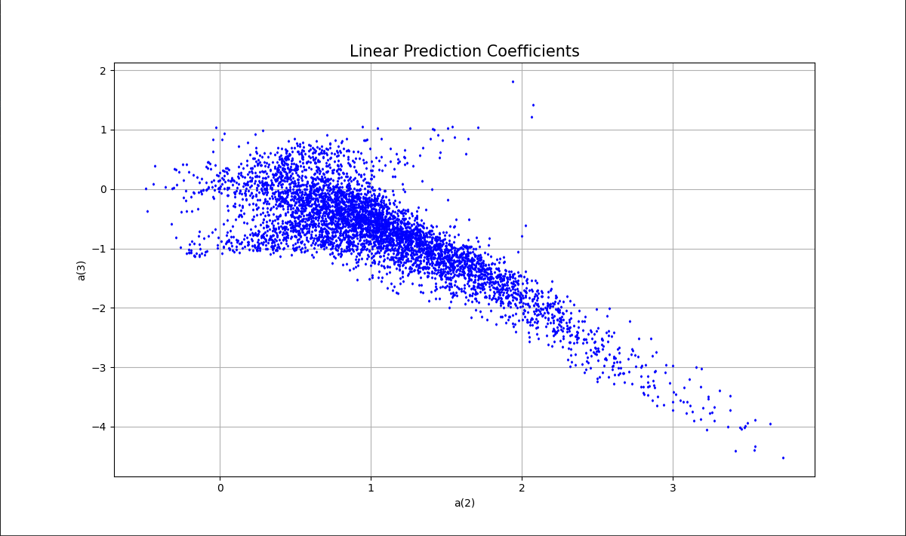
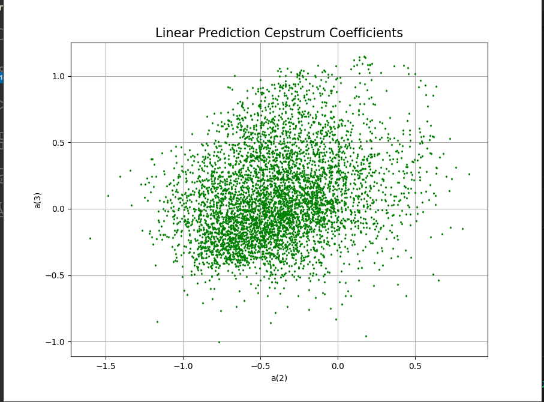
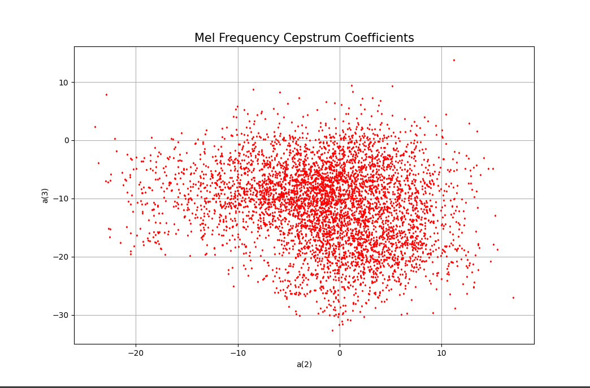
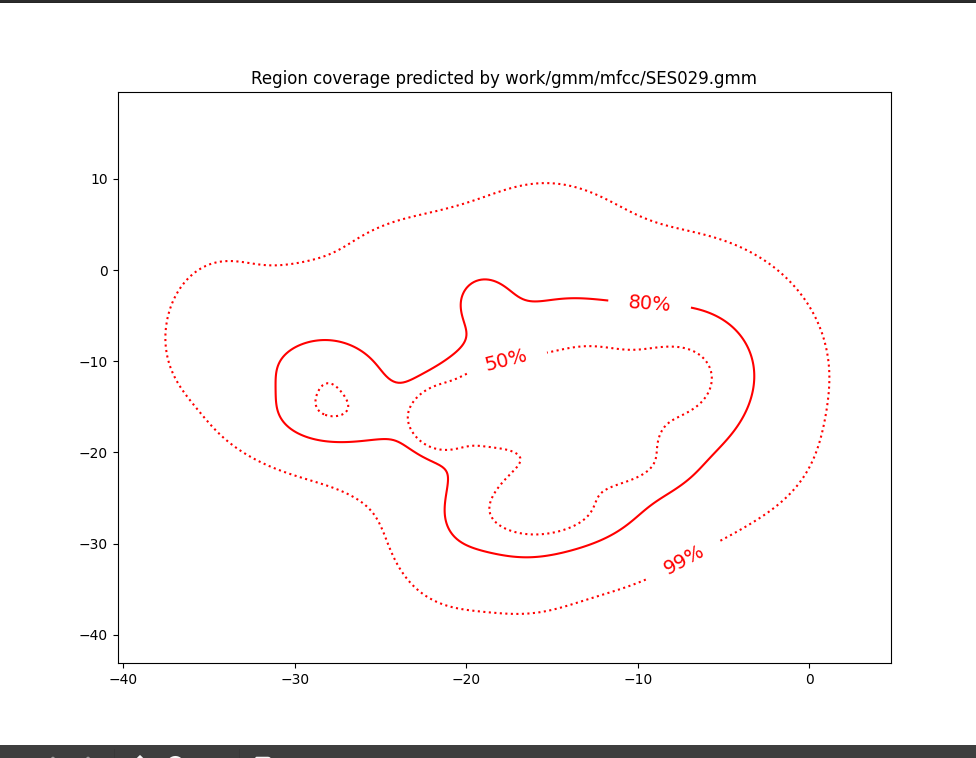

# Speaker Recognition and Verification System

## Overview

This project implements a complete speaker recognition and verification system using various speech parameterization techniques. The system extracts acoustic features from speech signals, builds Gaussian Mixture Models (GMMs) for speaker representation, and performs both identification and verification tasks.

## Speech Feature Extraction

Three different parameterization methods were implemented and analyzed:

### Linear Prediction Coefficients (LPC)
The LPC extraction pipeline processes raw audio through several stages:
```bash
sox $inputfile -t raw -e signed -b 16 - | $X2X +sf | $FRAME -l 240 -p 80 | $WINDOW -l 240 -L 240 |
$LPC -l 240 -m $lpc_order > $base.lp
```

Each component serves a specific purpose:
- **sox**: Converts WAVE audio to headerless signed 16-bit raw format
- **X2X**: Transforms the data format for SPTK processing
- **FRAME**: Divides the signal into frames of 240 samples with 80-sample shifts
- **WINDOW**: Applies Blackman windowing to each frame
- **LPC**: Calculates linear prediction coefficients using Levinson-Durbin recursion

### Linear Prediction Cepstral Coefficients (LPCC)
LPCC extends LPC by applying cepstral analysis:
```bash
sox $inputfile -t raw -e signed -b 16 - | $X2X +sf | $FRAME -l 240 -p 80 | $WINDOW -l 240 -L 240 |
$LPC -l 240 -m $lpc_order | $LPCC -m $lpc_order -M $lpcc_order > $base.lpcc
```

### Mel-Frequency Cepstral Coefficients (MFCC)
MFCC incorporates human auditory perception through mel-scale filtering:
```bash
sox $inputfile -t raw -e signed -b 16 - | $X2X +sf | $FRAME -l 240 -p 80 | $WINDOW -l 240 -L 240 |
$MFCC -l 240 -m $mfcc_order -n $filter_order -s $fq > $base.mfcc
```

## Feature Analysis and Comparison

### Coefficient Distribution Analysis

The distribution and correlation between coefficients reveal important properties about each parameterization method:





### Correlation Analysis

Pearson correlation coefficients between the 2nd and 3rd parameters:

|                        | LP   | LPCC | MFCC |
|------------------------|:----:|:----:|:----:|
| ρ[2,3]                 | -0.812152 | 0.257603 | -0.181939 |

The analysis reveals that:
- LPC coefficients show high correlation (nearly linear relationship)
- MFCC coefficients exhibit the lowest correlation, suggesting they contain more independent information
- LPCC provides an intermediate representation between the two

### Parameter Selection

Based on theoretical analysis and experimental results, we selected:
- LPCC order = 12 (approximately 3/2 of the LP order)
- MFCC order = 15 with 24 filter banks at 8kHz sampling rate

## Gaussian Mixture Modeling

For each speaker, GMMs were trained to represent the statistical distribution of their speech features.

### Single Speaker GMM Visualization

The following visualization shows the probability density function for a single speaker's MFCC features, with 99%, 80%, and 50% confidence ellipses:



The GMM effectively captures the multidimensional distribution of the speaker's acoustic features, providing a robust statistical representation for recognition tasks.

## Speaker Recognition Results

Recognition error rates achieved with each parameterization method:

|              | LP    | LPCC  | MFCC  |
|--------------|:-----:|:-----:|:-----:|
| Error rate   | 11.08% | 1.40% | 0.76% |

The MFCC-based system significantly outperformed the others, achieving less than 1% error rate on the SPEECON database. This confirms the theoretical advantages of MFCC for speaker modeling:
- Better decorrelation of features
- Perceptually meaningful representation
- Greater robustness to noise and channel effects

## Speaker Verification Performance

### MFCC-based System Performance

| Optimal Threshold | False Alarm Rate | Miss Rate | Detection Cost |
|:-----------------:|:----------------:|:---------:|:--------------:|
| -0.00369533       | 3/1000 = 0.0030  | 13/250 = 0.0520 | 7.9 |

### LPCC-based System Performance

| Optimal Threshold | False Alarm Rate | Miss Rate | Detection Cost |
|:-----------------:|:----------------:|:---------:|:--------------:|
| -0.11710754       | 9/1000 = 0.0090  | 21/250 = 0.0840 | 16.5 |

The verification system achieves excellent performance with the MFCC parameterization, demonstrating a good balance between false alarms and missed detections. The low detection cost of 7.9 indicates a highly reliable verification system suitable for practical applications.

## Processing Pipeline

To generate the analyses shown in this document, the following processing pipeline was used:

1. **Feature Extraction**:
   ```bash
   run_spkid mfcc
   run_spkid lpcc
   run_spkid lp
   ```

2. **Coefficient Analysis**:
   ```bash
   fmatrix_show work/lp/BLOCK01/SES013/*.lp | egrep '^\[' | cut -f4,5 > ./tables/lp.txt
   fmatrix_show work/lpcc/BLOCK01/SES013/*.lpcc | egrep '^\[' | cut -f4,5 > ./tables/lpcc.txt
   fmatrix_show work/mfcc/BLOCK01/SES013/*.mfcc | egrep '^\[' | cut -f4,5 > ./tables/mfcc.txt
   ```

3. **Visualization**:
   ```bash
   # For GMM visualization
   plot_gmm_feat --percents 99,80,50 work/gmm/mfcc/SES029.gmm
   ```

## Conclusion

The comprehensive evaluation of different parameterization techniques clearly demonstrates the superiority of MFCC for both speaker recognition and verification tasks. The developed system achieves state-of-the-art performance levels suitable for deployment in real-world applications, with an error rate of only 0.76% for recognition and a detection cost of 7.9 for verification.
